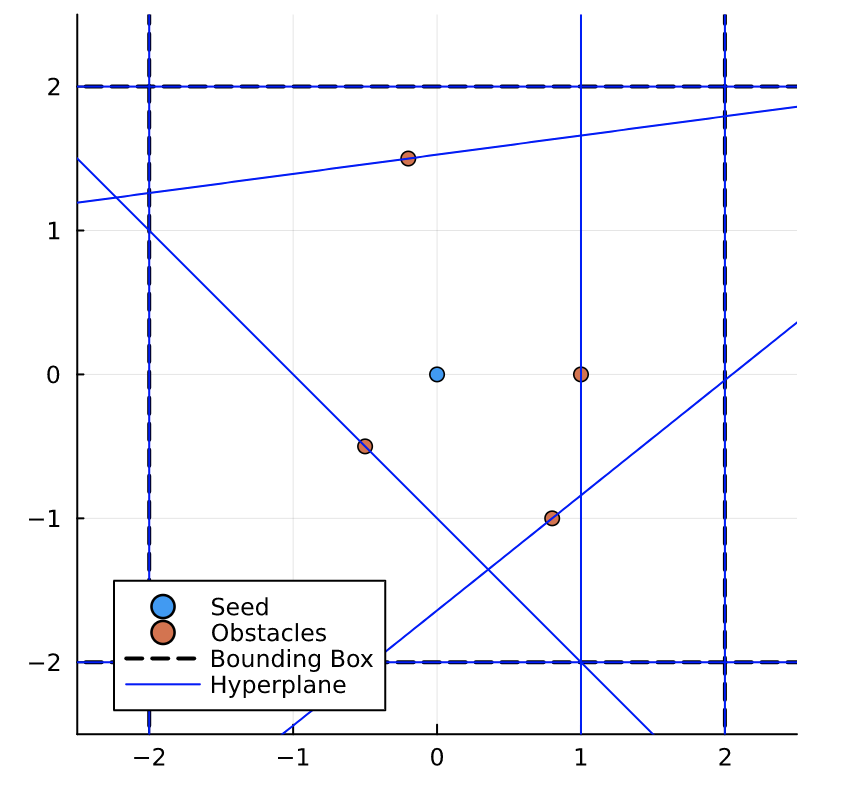

# DecompUtil


[](https://dev10110.github.io/DecompUtil.jl/stable/)
[](https://dev10110.github.io/DecompUtil.jl/dev/)
[](https://github.com/dev10110/DecompUtil.jl/actions/workflows/CI.yml?query=branch%3Amain)


Documentation for [DecompUtil](https://github.com/dev10110/DecompUtil.jl).

This is a julia wrapper to [DecompUtil](https://github.com/sikang/DecompUtil), created by Devansh Agrawal. I have added a few small functionalities, but have not exported all of the functions provided by the original authors. If there are some particular functions you would like to be able to use, let me know and I should be able to wrap them without much difficulty. 

This is research code, and so there is no guarantee of correctness, but so far it has worked well for me. If you find an error, please let me know by raising a Github Issue. 

All credits should go to the original authors:
```
@article{liu2017planning,
  title={Planning dynamically feasible trajectories for quadrotors using safe flight corridors in 3-d complex environments},
  author={Liu, Sikang and Watterson, Michael and Mohta, Kartik and Sun, Ke and Bhattacharya, Subhrajit and Taylor, Camillo J and Kumar, Vijay},
  journal={IEEE Robotics and Automation Letters},
  volume={2},
  number={3},
  pages={1688--1695},
  year={2017},
  publisher={IEEE}
}
```

For those interested, the wrapper works by exposing a [`C` interface](https://github.com/dev10110/DecompUtil_C) to the original library, creating a [JLL package](https://github.com/JuliaBinaryWrappers/DecompUtil_jll.jl) using [BinaryBuilder](https://github.com/JuliaPackaging/BinaryBuilder.jl), and then creating the [Julia package](https://github.com/dev10110/DecompUtil.jl).

## Quick Start

The main export of this library is `seedDecomp`. This performs a decomposition in a 2D or 3D space, and returns a list of hyperplanes that indicate the safe flight corridor. 

2D example:
```
using DecompUtil

# seed from which the decomposition starts
pos = [0,0.] 

# define all the obstacle points
obs = [[-0.2, 1.5], [1, 0.], [0.8,-1.], [ -0.5, -0.5]]

# defines the bounding box (i.e., -2:2 on x axis, -2:2 on y axis)
bbox = [2,2.]

# define a dilation radius
dilation_radius = 0.1

result = seedDecomp(pos, obs, bbox, dilation_radius)
```

This returns a vector of `Hyperplane`s, that can be visualized as:




Please see the [documentation](https://dev10110.github.io/DecompUtil.jl/dev/) for additional utilities, and a more detailed description. 
